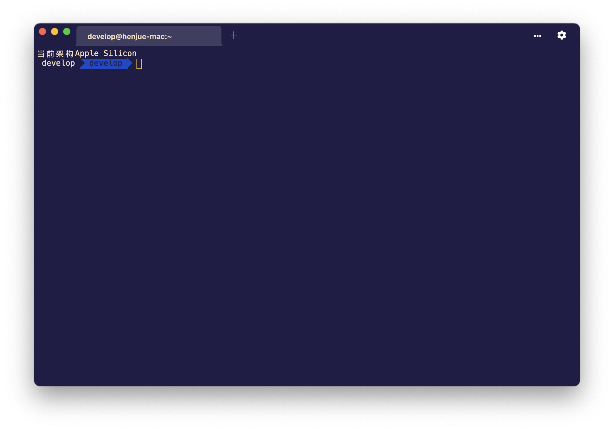
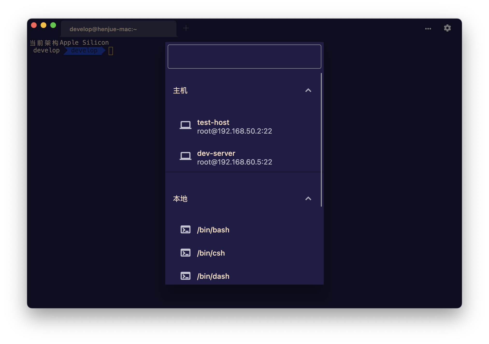
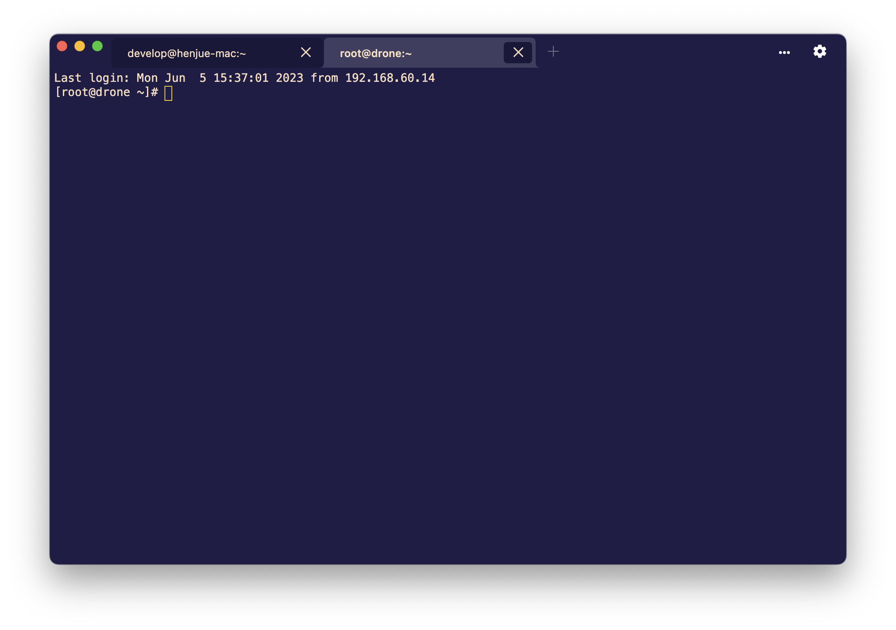
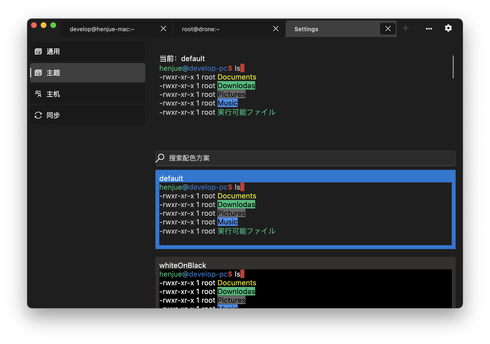
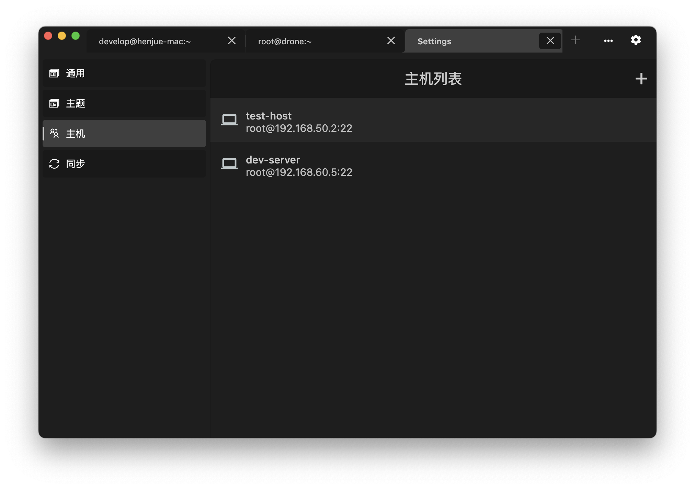
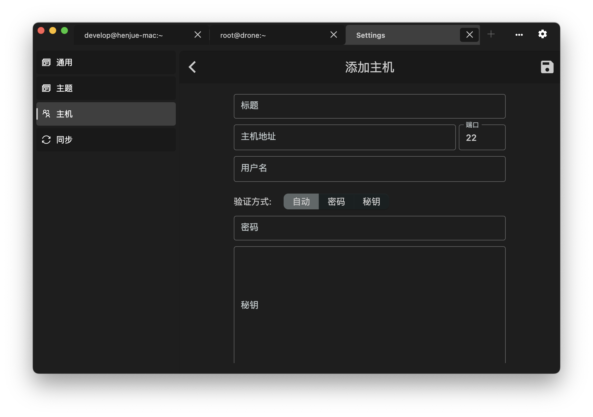

# fterm

fterm是一款基于Flutter开发的跨平台终端工具

# 有什么优点呢？
1. 没有很多复杂的功能，几乎想自带的终端一样使用。
2. 相较于很多使用Electron开发的终端应用,拥有较小的体积。
3. 完全开源，配置信息加密([flutter_secure_storage](https://pub.dev/packages/flutter_secure_storage))存放,不用担心有什么安全问题。
4. 支持webdav进行多端同步应用配置，自己的数据自己托管。  

# 功能
- [x] 本地终端
- [x] 多种主题颜色
- [x] ssh主机连接
- [x] ssh配置本地加密存储
- [x] 通过ssh跳板机连接目标主机
- [x] 支持zmodem
- [ ] ssh配置多端同步

# 部分截图

## Special thanks to the following items which helped me a lot
[https://github.com/TerminalStudio]()  
[https://github.com/Eugeny/tabby]()
